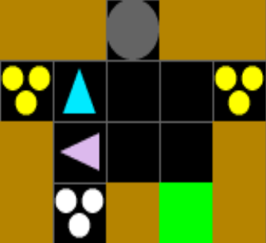
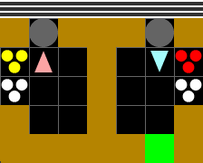

# Overcooked

Cooperative multi-agent cooking. Agents pick up ingredients, fill pots, wait for soups to cook, plate them, and deliver for reward.

{ width="60%" }

## Variants

| Environment ID | Agents | Layout | Orders |
|----------------|--------|--------|--------|
| `Overcooked-CrampedRoom-V0` | 2 | Cramped Room | No |
| `Overcooked-AsymmetricAdvantages-V0` | 2 | Asymmetric Advantages | No |
| `Overcooked-CoordinationRing-V0` | 2 | Coordination Ring | No |
| `Overcooked-ForcedCoordination-V0` | 2 | Forced Coordination | No |
| `Overcooked-CounterCircuit-V0` | 2 | Counter Circuit | No |
| `Overcooked-CrampedRoom-SingleAgent-V0` | 1 | Cramped Room | No |
| `Overcooked-MixedKitchen-V0` | 2 | Mixed Kitchen | Yes |
| `Overcooked-CrampedMixedKitchen-V0` | 2 | Cramped Mixed Kitchen | Yes |
| `Overcooked-OrderDelivery-V0` | 1 | Order Delivery | Yes |
| `OvercookedV2-GroundedCoordSimple-V0` | 2 | [Grounded Coord Simple](#grounded-coordination-simple) | Target recipe |
| `OvercookedV2-GroundedCoordRing-V0` | 2 | [Grounded Coord Ring](#grounded-coordination-ring) | Target recipe |
| `OvercookedV2-TestTimeSimple-V0` | 2 | [Test-Time Simple](#test-time-protocol-simple) | Target recipe |
| `OvercookedV2-TestTimeWide-V0` | 2 | [Test-Time Wide](#test-time-protocol-wide) | Target recipe |
| `OvercookedV2-DemoCookSimple-V0` | 2 | [Demo Cook Simple](#demo-cook-simple) | Target recipe |
| `OvercookedV2-DemoCookWide-V0` | 2 | [Demo Cook Wide](#demo-cook-wide) | Target recipe |

## Layouts

### Cramped Room
```
CCUCC
O   O
C   C
C=C@C
```

### Asymmetric Advantages
```
CCCCCCCCC
O C@COC @
C   U   C
C   U   C
CCC=C=CCC
```

### Coordination Ring
```
CCCUC
C   U
= C C
O   C
CO@CC
```

### Forced Coordination
```
CCCUC
O+C U
O C C
= C+C
```

### Counter Circuit
```
CCCUUCCC
C      C
= CCCC @
C      C
CCCOOCCC
```

### Mixed Kitchen
```
CUCCCUC
O+ C +T
=  C  =
C  C  C
CCCCC@C
```

### Cramped Mixed Kitchen
```
CCUCC
O+ +T
=   =
C   C
CC@CC
```

### Order Delivery
```
CCCCC
C1 2C
C + C
C @ C
CCCCC
```

`1` and `2` are pre-placed soup stacks. The agent picks up soups and delivers them to fill orders.

## Objects

| Char | Name | Description |
|------|------|-------------|
| `O` | OnionStack | Infinite onion dispenser |
| `T` | TomatoStack | Infinite tomato dispenser |
| `o` | Onion | Individual onion (pickupable) |
| `t` | Tomato | Individual tomato (pickupable) |
| `U` | Pot | Cooking container (capacity 3, pickup requires plate) |
| `=` | PlateStack | Infinite plate dispenser |
| `P` | Plate | Individual plate (pickupable) |
| `S` | OnionSoup | Cooked onion soup (pickupable, deliverable) |
| `!` | TomatoSoup | Cooked tomato soup (pickupable, deliverable) |
| `@` | DeliveryZone | Delivery target |
| `C` | Counter | Surface that holds one object |

## Recipes

Recipes are defined in `cogrid.envs.overcooked.recipes` and declared on the `Pot` class:

```python
from cogrid.core.objects.containers import Container
from cogrid.envs.overcooked.recipes import Recipe

@register_object_type("pot", scope="overcooked")
class Pot(GridObj):
    container = Container(capacity=3, pickup_requires="plate")
    recipes = [
        Recipe(["onion", "onion", "onion"], result="onion_soup", cook_time=30, reward=1.0),
        Recipe(["tomato", "tomato", "tomato"], result="tomato_soup", cook_time=30, reward=1.0),
    ]
```

`Container` is a core primitive (any object that holds items). `Recipe` is Overcooked-specific — it declares how ingredients combine into a result after cooking.

| Parameter | Type | Default | Description |
|-----------|------|---------|-------------|
| `ingredients` | `list[str]` | required | Object IDs of required ingredients (order does not matter). |
| `result` | `str` | required | Object ID produced when cooking finishes. |
| `cook_time` | `int` | `0` | Steps to cook once the container is full. |
| `reward` | `float` | `0.0` | Reward value on delivery of the result. |

**Pipeline:** Pick up ingredient from stack -> place in pot (x3) -> pot cooks for 30 steps -> pick up plate from plate stack -> pick up soup from pot (requires plate) -> deliver at delivery zone.

The autowire system reads `container` and `recipes` and generates all interaction branches, tick handlers, extra state, and static tables.

## Actions

All Overcooked variants use `cardinal_actions`:

| Index | Action | Overcooked Context |
|-------|--------|--------------------|
| 0 | MoveUp | Move one cell up |
| 1 | MoveDown | Move one cell down |
| 2 | MoveLeft | Move one cell left |
| 3 | MoveRight | Move one cell right |
| 4 | PickupDrop | Pick up ingredient/plate/soup, place in pot, place on counter |
| 5 | Toggle | Activates button indicator (V2 Grounded Coordination only) |
| 6 | Noop | Do nothing |

## Observations

Default feature set (Cramped Room config):

| Name | Per-Agent | Dim | Description |
|------|-----------|-----|-------------|
| `agent_dir` | Yes | 4 | One-hot facing direction |
| `overcooked_inventory` | Yes | 5 | One-hot over 5 pickupable types |
| `next_to_counter` | Yes | 4 | Cardinal adjacency to counters |
| `next_to_pot` | Yes | 16 | Pot adjacency with contents/timer encoding |
| `object_type_masks` | No | 770 | Binary spatial masks for 10 object types |
| `ordered_pot_features` | Yes | 24 | Per-pot features in grid-scan order |
| `dist_to_other_players` | Yes | 2 | Delta vector to partner |
| `agent_position` | Yes | 2 | Grid coordinates |
| `can_move_direction` | Yes | 4 | Passable cardinal neighbors |

Mixed Kitchen variants add `order_observation` (dim 9).

## Rewards

### Standard (no orders)

| Class | Coefficient | Common | Trigger |
|-------|-------------|--------|---------|
| `DeliveryReward` | 1.0 | Yes | Deliver any recipe output to delivery zone |
| `OnionInPotReward` | 0.1 | No | Place an onion into a pot with remaining capacity |
| `SoupInDishReward` | 0.3 | No | Pick up finished soup from pot while holding a plate |

### With orders

| Class | Coefficient | Common | Trigger |
|-------|-------------|--------|---------|
| `OrderDeliveryReward` | 1.0 | Yes | Deliver a soup matching an active order (includes time-based tip bonus) |
| `OrderGatedIngredientInPotReward` | 0.1 | No | Place ingredient in pot, gated on matching active order |
| `ExpiredOrderPenalty` | -0.75 | Yes | An active order expires |

### Other available rewards

| Class | Description |
|-------|-------------|
| `OnionSoupDeliveryReward` | Onion-soup-only delivery (simpler single-recipe variant) |
| `OrderGatedSoupInDishReward` | Soup plating gated on active orders |

## Orders

By default the order queue is disabled -- any valid delivery earns a reward. When enabled, orders spawn stochastically, count down, and expire with a penalty.

{ width="50%" }

```python
order_config = {
    "max_active": 3,                                        # max concurrent orders
    "spawn_probs": {"onion_soup": 0.05, "tomato_soup": 0.05},  # per-recipe spawn probability
    "time_limit": 100,                                      # steps before expiry
}
```

| Parameter | Type | Description |
|-----------|------|-------------|
| `max_active` | `int` | Maximum simultaneous orders. |
| `spawn_probs` | `dict[str, float]` | Per-recipe spawn probability per step into each empty slot. Must sum to &le; 1.0. |
| `time_limit` | `int` | Steps before an order expires. |

Enable by setting `"orders"` in the config and adding `order_queue_tick` as the tick function:

```python
from cogrid.envs.overcooked.config import build_order_extra_state, order_queue_tick

config["orders"] = order_config
config["tick_fn"] = order_queue_tick
config["extra_state_init_fn"] = functools.partial(build_order_extra_state, order_config)
```

The `OrderObservation` feature encodes active orders into the observation vector:

- **Dimension:** `max_active * (n_recipes + 1)` (default: 3 * 3 = 9).
- **Per order:** recipe one-hot (`n_recipes`) + normalized time remaining (0.0--1.0).
- **Global:** all agents see the same order state.

Add `"order_observation"` to the features list.

## Code Example

=== "NumPy"

    ```python
    from cogrid.envs import registry
    import cogrid.envs.overcooked

    env = registry.make("Overcooked-CrampedRoom-V0")
    obs, info = env.reset(seed=0)

    for _ in range(100):
        actions = {a: env.action_space(a).sample() for a in env.agents}
        obs, rewards, terminateds, truncateds, info = env.step(actions)
    ```

=== "JAX"

    ```python
    import jax
    from cogrid.envs import registry
    import cogrid.envs.overcooked

    env = registry.make("Overcooked-CrampedRoom-V0", backend="jax")
    env.reset(seed=0)
    n_agents = len(env.possible_agents)
    n_actions = len(env.action_set)

    def step_fn(carry, _):
        state, key = carry
        key, step_key, action_key = jax.random.split(key, 3)
        actions = {i: jax.random.randint(jax.random.fold_in(action_key, i), (), 0, n_actions)
                   for i in range(n_agents)}
        obs, state, rewards, terminated, truncated, info = env.jax_step(step_key, state, actions)
        return (state, key), rewards

    @jax.jit
    def rollout(key):
        key, reset_key = jax.random.split(key)
        obs, state, info = env.jax_reset(reset_key)
        (final_state, _), all_rewards = jax.lax.scan(
            step_fn, (state, key), None, length=env.max_steps,
        )
        return all_rewards  # {agent_id: (max_steps,)}

    rewards = rollout(jax.random.key(0))
    ```

## OvercookedV2 Benchmarks

Six environments adapted from [Gessler et al., 2025](https://arxiv.org/abs/2503.17821) that test coordination under asymmetric information. One agent can see the target recipe (via a recipe indicator), while the other cannot. The environments vary in what communication channel is available.

All V2 environments share: 2 agents, `observable_radius=2` (partial observability via `local_view`), `max_steps=400`, stochastic recipe selection (resampled on each correct delivery), and `cook_time=20`.

### Coordination Categories

| Category | Button | Incorrect penalty | Communication channel |
|----------|:------:|:-----------------:|----------------------|
| **Grounded Coordination** | Yes (-5 cost) | -20 | Button reveals recipe to partner |
| **Test-Time Protocol** | No | -20 | Agents must form implicit protocols |
| **Demo Cook** | No | None | Agent actions signal recipe implicitly |

### Variants

| Environment ID | Category | Layout |
|----------------|----------|--------|
| `OvercookedV2-GroundedCoordSimple-V0` | Grounded Coordination | 8x5 |
| `OvercookedV2-GroundedCoordRing-V0` | Grounded Coordination | 9x9 |
| `OvercookedV2-TestTimeSimple-V0` | Test-Time Protocol | 8x5 |
| `OvercookedV2-TestTimeWide-V0` | Test-Time Protocol | 6x7 |
| `OvercookedV2-DemoCookSimple-V0` | Demo Cook | 11x5 |
| `OvercookedV2-DemoCookWide-V0` | Demo Cook | 11x6 |

### How It Works

1. At reset, a **target recipe** is sampled uniformly from `["onion_soup", "tomato_soup"]`.
2. The **recipe indicator** (`R`) writes the target recipe into the grid state. Agents within their observable radius can see it; agents outside cannot.
3. In Grounded Coordination layouts, a **button indicator** (`L`) can be toggled to temporarily reveal the recipe (10 steps) at a cost of -5 reward.
4. The **OpenPot** (`u`) accepts any combination of ingredients — including distractor ingredients (broccoli, mushroom). There is no validation at placement time.
5. At delivery, the reward system checks whether the delivered soup matches the target recipe: correct = +20, incorrect = -20 (except Demo Cook, where incorrect = 0).
6. After a correct delivery, the target recipe is resampled.

### V2 Layouts

#### Grounded Coordination Simple
```
CCBCCCCC
C  C=  O
R +Lu+ X
C  C=  T
CCBCCCCC
```

#### Grounded Coordination Ring
```
CCCBRBCCC
C       C
C CCLCC C
B O   = B
R+X+u + R
B T   = B
C CCLCC C
C       C
CCCBRBCCC
```

#### Test-Time Protocol Simple
```
CCBCCCCC
C  C=  O
R +Cu+ X
C  C=  T
CCBCCCCC
```

#### Test-Time Protocol Wide
```
CCX=CC
O +  O
T    T
CuCuCC
M +  M
C    C
CCRCCC
```

#### Demo Cook Simple
```
CCCCCRBCoCC
O      C  =
C     +u+ X
T      C  =
CCCCCRBCtCC
```

#### Demo Cook Wide
```
CCCC=X=CCCC
CCCO + TCCC
CCCCCuCCCCC
C    +    C
O  CMRMC  O
CTCCCCCCCTC
```

### V2 Objects

| Char | Name | Description |
|------|------|-------------|
| `u` | OpenPot | Pot that accepts any ingredient combination (20 recipes) |
| `R` | RecipeIndicator | Displays the current target recipe (wall-like, always visible within radius) |
| `L` | ButtonIndicator | Toggle to reveal recipe for 10 steps at -5 reward cost |
| `X` | OpenDeliveryZone | Accepts any soup type (correct or incorrect) |
| `B` | BroccoliStack | Distractor ingredient dispenser |
| `M` | MushroomStack | Distractor ingredient dispenser |
| `b` | Broccoli | Individual broccoli (pickupable) |
| `m` | Mushroom | Individual mushroom (pickupable) |

### V2 Rewards

| Class | Coefficient | Common | Trigger |
|-------|-------------|--------|---------|
| `TargetRecipeDeliveryReward` | 20.0 | Yes | Deliver soup: +20 correct, -20 incorrect (configurable via `penalize_incorrect`) |
| `ButtonActivationCost` | 5.0 | Yes | Toggle the button indicator |

### V2 Config Example

```python
from cogrid.envs import registry

env = registry.make("OvercookedV2-GroundedCoordSimple-V0")
obs, info = env.reset(seed=0)

for _ in range(400):
    actions = {a: env.action_space(a).sample() for a in env.agents}
    obs, rewards, terminateds, truncateds, info = env.step(actions)
```

Target recipes and delivery behavior are configured in the environment config:

```python
config = {
    ...
    "target_recipes": ["onion_soup", "tomato_soup"],
    "resample_on_delivery": True,
}
```

---

## Custom Ingredients

Register new ingredient + stack pairs at runtime with `make_ingredient_and_stack()`. Call before environment creation so interaction tables include the new types.

```python
from cogrid.envs.overcooked.overcooked_grid_objects import make_ingredient_and_stack
from cogrid.core import constants

Mushroom, MushroomStack = make_ingredient_and_stack(
    ingredient_name="mushroom",
    ingredient_char="m",
    ingredient_color=constants.Colors.Brown,
    stack_name="mushroom_stack",
    stack_char="M",
    scope="overcooked",
)
```

The `OvercookedInventory` feature auto-adjusts -- it discovers all pickupable types from the registry at compose time.

## Config Reference

Full Cramped Room config:

```python
cramped_room_config = {
    "name": "overcooked",
    "num_agents": 2,
    "action_set": "cardinal_actions",
    "features": [
        "agent_dir",
        "overcooked_inventory",
        "next_to_counter",
        "next_to_pot",
        "object_type_masks",
        "ordered_pot_features",
        "dist_to_other_players",
        "agent_position",
        "can_move_direction",
    ],
    "rewards": [
        DeliveryReward(coefficient=1.0, common_reward=True),
        OnionInPotReward(coefficient=0.1, common_reward=False),
        SoupInDishReward(coefficient=0.3, common_reward=False),
    ],
    "grid": {"layout": "overcooked_cramped_room_v0"},
    "max_steps": 1000,
    "scope": "overcooked",
    "pickupable_types": ["onion", "onion_soup", "plate", "tomato", "tomato_soup"],
}
```

Different layouts swap `grid.layout`. Different gameplay swaps `rewards` and `features`. The single-agent variant sets `num_agents: 1`.
