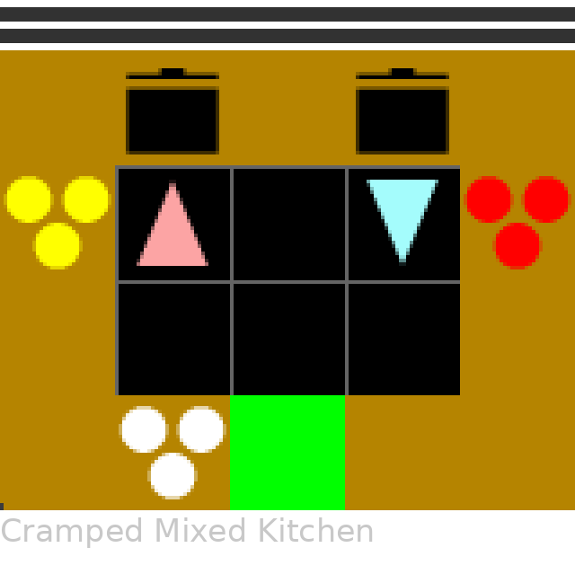

# Overcooked

Originally proposed by Carroll et al. (2019), the Overcooked-AI environments have become a standard in cooperative multi-agent reinforcement learning and human-AI interaction.

<figure markdown="span">
  { width="100%" }
</figure>

## Variants

| Environment ID | Agents | Layout | Orders |
|----------------|--------|--------|--------|
| `Overcooked-CrampedRoom-V0` | 2 | Cramped Room | No |
| `Overcooked-AsymmetricAdvantages-V0` | 2 | Asymmetric Advantages | No |
| `Overcooked-CoordinationRing-V0` | 2 | Coordination Ring | No |
| `Overcooked-ForcedCoordination-V0` | 2 | Forced Coordination | No |
| `Overcooked-CounterCircuit-V0` | 2 | Counter Circuit | No |
| `Overcooked-CrampedRoom-SingleAgent-V0` | 1 | Cramped Room | No |
| `Overcooked-CrampedMixedKitchen-V0` | 2 | Cramped Mixed Kitchen | Yes |

## Objects

| Char | Name | Description |
|------|------|-------------|
| `O` | OnionStack | Infinite onion dispenser |
| `T` | TomatoStack | Infinite tomato dispenser |
| `o` | Onion | Individual onion (pickupable) |
| `t` | Tomato | Individual tomato (pickupable) |
| `U` | Pot | Cooking container (capacity 3, pickup requires plate) |
| `=` | PlateStack | Infinite plate dispenser |
| `P` | Plate | Individual plate (pickupable) |
| `S` | OnionSoup | Cooked onion soup (pickupable, deliverable) |
| `!` | TomatoSoup | Cooked tomato soup (pickupable, deliverable) |
| `@` | DeliveryZone | Delivery target |
| `C` | Counter | Surface that holds one object |

## Recipes

Recipes are defined in `cogrid.envs.overcooked.recipes` and declared on the `Pot` class:

```python
from cogrid.core.objects.containers import Container
from cogrid.envs.overcooked.recipes import Recipe

@register_object_type("pot", scope="overcooked")
class Pot(GridObj):
    container = Container(capacity=3, pickup_requires="plate")
    recipes = [
        Recipe(["onion", "onion", "onion"], result="onion_soup", cook_time=30, reward=1.0),
        Recipe(["tomato", "tomato", "tomato"], result="tomato_soup", cook_time=30, reward=1.0),
    ]
```

`Container` is a core primitive (any object that holds items). `Recipe` is Overcooked-specific — it declares how ingredients combine into a result after cooking.

| Parameter | Type | Default | Description |
|-----------|------|---------|-------------|
| `ingredients` | `list[str]` | required | Object IDs of required ingredients (order does not matter). |
| `result` | `str` | required | Object ID produced when cooking finishes. |
| `cook_time` | `int` | `0` | Steps to cook once the container is full. |
| `reward` | `float` | `0.0` | Reward value on delivery of the result. |

**Pipeline:** Pick up ingredient from stack -> place in pot (x3) -> pot cooks for 30 steps -> pick up plate from plate stack -> pick up soup from pot (requires plate) -> deliver at delivery zone.

The autowire system reads `container` and `recipes` and generates all interaction branches, tick handlers, extra state, and static tables.

## Actions

All Overcooked variants use `cardinal_actions`:

| Index | Action | Overcooked Context |
|-------|--------|--------------------|
| 0 | MoveUp | Move one cell up |
| 1 | MoveDown | Move one cell down |
| 2 | MoveLeft | Move one cell left |
| 3 | MoveRight | Move one cell right |
| 4 | PickupDrop | Pick up ingredient/plate/soup, place in pot, place on counter |
| 5 | Toggle | Activates button indicator (V2 Grounded Coordination only) |
| 6 | Noop | Do nothing |

## Observations

Default feature set (Cramped Room config):

| Name | Per-Agent | Dim | Description |
|------|-----------|-----|-------------|
| `agent_dir` | Yes | 4 | One-hot facing direction |
| `overcooked_inventory` | Yes | 5 | One-hot over 5 pickupable types |
| `next_to_counter` | Yes | 4 | Cardinal adjacency to counters |
| `next_to_pot` | Yes | 16 | Pot adjacency with contents/timer encoding |
| `object_type_masks` | No | 770 | Binary spatial masks for 10 object types |
| `ordered_pot_features` | Yes | 24 | Per-pot features in grid-scan order |
| `dist_to_other_players` | Yes | 2 | Delta vector to partner |
| `agent_position` | Yes | 2 | Grid coordinates |
| `can_move_direction` | Yes | 4 | Passable cardinal neighbors |

## Rewards

| Class | Coefficient | Common | Trigger |
|-------|-------------|--------|---------|
| `DeliveryReward` | 20.0 | Yes | Deliver any recipe output to delivery zone |
| `OnionInPotReward` | 3.0 | Yes | Place an onion into a pot with remaining capacity |
| `SoupInDishReward` | 5.0 | Yes | Pick up finished soup from pot while holding a plate |

## Code Example

=== "NumPy"

    ```python
    import cogrid

    env = cogrid.make("Overcooked-CrampedRoom-V0")
    obs, info = env.reset(seed=0)

    for _ in range(100):
        actions = {a: env.action_space(a).sample() for a in env.agents}
        obs, rewards, terminateds, truncateds, info = env.step(actions)
    ```

=== "JAX"

    ```python
    import jax
    import cogrid

    env = cogrid.make("Overcooked-CrampedRoom-V0", backend="jax")
    env.reset(seed=0)
    n_agents = len(env.possible_agents)
    n_actions = len(env.action_set)

    def step_fn(carry, _):
        state, key = carry
        key, step_key, action_key = jax.random.split(key, 3)
        actions = {i: jax.random.randint(jax.random.fold_in(action_key, i), (), 0, n_actions)
                   for i in range(n_agents)}
        obs, state, rewards, terminated, truncated, info = env.jax_step(step_key, state, actions)
        return (state, key), rewards

    @jax.jit
    def rollout(key):
        key, reset_key = jax.random.split(key)
        obs, state, info = env.jax_reset(reset_key)
        (final_state, _), all_rewards = jax.lax.scan(
            step_fn, (state, key), None, length=env.max_steps,
        )
        return all_rewards  # {agent_id: (max_steps,)}

    rewards = rollout(jax.random.key(0))
    ```

---

## Stochastic Orders (Cramped Mixed Kitchen)

The `Overcooked-CrampedMixedKitchen-V0` layout adds a stochastic order queue to the base Overcooked mechanics. Orders spawn randomly, count down, and expire with a penalty — similar to the Overcooked video game. This introduces a planning and coordination challenge beyond the standard fixed-recipe layouts: agents must identify which recipe is needed, coordinate to fulfill it before the timer runs out, and avoid delivering the wrong soup.

<figure markdown="span">
  { width="40%" }
</figure>

### Order Queue

Orders are controlled by an order configuration:

```python
order_config = {
    "spawn_probs": {"onion_soup": 0.005, "tomato_soup": 0.005},
    "max_active": 2,
    "time_limit": 300,
}
```

| Parameter | Type | Description |
|-----------|------|-------------|
| `max_active` | `int` | Maximum simultaneous orders. |
| `spawn_probs` | `dict[str, float]` | Per-recipe spawn probability per step into each empty slot. Must sum to &le; 1.0. |
| `time_limit` | `int` | Steps before an order expires. |

At each step, each empty order slot is independently sampled — if the roll lands on a recipe, that order becomes active with a countdown timer set to `time_limit`. Active orders tick down by 1 each step and expire (clearing the slot) when the timer reaches zero.

### Order Observation

The `order_observation` feature encodes active orders into the observation vector:

- **Dimension:** `max_active * (n_recipes + 1)`.
- **Per order slot:** recipe one-hot (`n_recipes`) + normalized time remaining (0.0–1.0).
- **Global:** both agents see the same order state.

Inactive slots are all zeros. Add `"order_observation"` to the features list to enable.

### Rewards

| Class | Coefficient | Common | Trigger |
|-------|-------------|--------|---------|
| `OrderDeliveryReward` | 20.0 | Yes | Deliver a soup matching an active order (+20 correct, -20 incorrect) |
| `OrderGatedIngredientInPotReward` | 3.0 | No | Place ingredient in pot, gated on matching active order |
| `ExpiredOrderPenalty` | -20.0 | Yes | An active order expires |

### Custom Order Configuration

Enable orders on any layout by adding the order config, tick function, and extra state initializer:

```python
import functools
from cogrid.envs.overcooked.config import build_order_extra_state, build_order_tick

config["orders"] = order_config
config["tick_fn"] = build_order_tick(order_config, recipe_results=["onion_soup", "tomato_soup"])
config["extra_state_init_fn"] = functools.partial(build_order_extra_state, order_config)
```

---

## Custom Ingredients

Register new ingredient + stack pairs at runtime with `make_ingredient_and_stack()`. Call before environment creation so interaction tables include the new types.

```python
from cogrid.envs.overcooked.overcooked_grid_objects import make_ingredient_and_stack
from cogrid.core import constants

Mushroom, MushroomStack = make_ingredient_and_stack(
    ingredient_name="mushroom",
    ingredient_char="m",
    ingredient_color=constants.Colors.Brown,
    stack_name="mushroom_stack",
    stack_char="M",
    scope="overcooked",
)
```

The `OvercookedInventory` feature auto-adjusts -- it discovers all pickupable types from the registry at compose time.

## Config Reference

Full Cramped Room config:

```python
cramped_room_config = {
    "name": "overcooked",
    "num_agents": 2,
    "action_set": "cardinal_actions",
    "features": [
        "agent_dir",
        "overcooked_inventory",
        "next_to_counter",
        "next_to_pot",
        "object_type_masks",
        "ordered_pot_features",
        "dist_to_other_players",
        "agent_position",
        "can_move_direction",
    ],
    "rewards": [
        DeliveryReward(coefficient=20.0, common_reward=True),
        OnionInPotReward(coefficient=3.0, common_reward=True),
        SoupInDishReward(coefficient=5.0, common_reward=True),
    ],
    "grid": {"layout": "overcooked_cramped_room_v0"},
    "max_steps": 1000,
    "scope": "overcooked",
    "pickupable_types": ["onion", "onion_soup", "plate", "tomato", "tomato_soup"],
}
```

Different layouts swap `grid.layout`. Different gameplay swaps `rewards` and `features`. The single-agent variant sets `num_agents: 1`.
