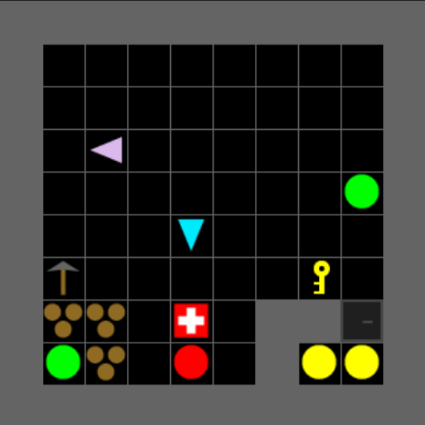

# Search & Rescue

## Overview

Search & Rescue is a cooperative environment inspired by the Minimap task
([Nguyen & Gonzalez, 2023](https://www.cmu.edu/dietrich/sds/ddmlab/papers/NguyenGonzalez2020.pdf)).
Two agents explore a partially-observable grid to locate and rescue victims of
varying difficulty while clearing obstacles that block their path.

{ width="60%" }

## Environment Details

### Victim Types

| Victim | Char | Color | Rescue Requirement | Reward |
|--------|------|-------|--------------------|--------|
| GreenVictim | `G` | Green | Any adjacent agent toggles | 0.1 |
| PurpleVictim | `P` | Purple | Any adjacent agent toggles | 0.2 |
| YellowVictim | `Y` | Yellow | Agent must be a Medic or carry a MedKit | 0.2 |
| RedVictim | `R` | Red | First agent with MedKit starts a 30-step countdown; a second agent must toggle within the window | -- |

### Items and Obstacles

| Object | Char | Description |
|--------|------|-------------|
| MedKit | `M` | Enables rescuing yellow victims; required to start red victim rescue |
| Pickaxe | `T` | Enables clearing rubble (or the Engineer role) |
| Rubble | `X` | Blocks movement; cleared by an agent with a pickaxe (reward: 0.05) |
| Door | `D` | Locked door; opened with a key |
| Key | `K` | Unlocks a locked door |

### Collaboration Patterns

- **Sequential** -- one agent clears rubble or unlocks a door so both agents
  can access new areas.
- **Parallel** -- rescuing a red victim requires two agents to act within a
  shared time window: one with a MedKit starts the countdown, and a different
  agent completes the rescue.

## Quick Start

```python
from cogrid.envs import registry
import cogrid.envs.search_rescue

env = registry.make("SearchRescue-Test-V0")
obs, info = env.reset(seed=42)

while env.agents:
    actions = {a: env.action_space.sample() for a in env.agents}
    obs, rewards, terminateds, truncateds, info = env.step(actions)
```

## Links

- [Custom Environment Tutorial](../tutorials/custom-environment.md) -- how
  environments are built using the component API
- [API Reference: cogrid.envs.search_rescue](../reference/cogrid/envs/search_rescue/index.md) --
  module documentation
