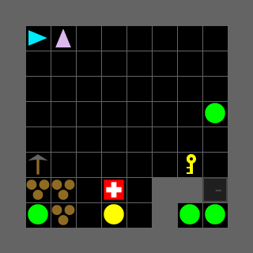

<div style="text-align: center;">
  
</div>

# CoGrid

CoGrid is a library for creating grid-based multi-agent environments for reinforcement learning research. It provides a functional, array-based simulation core that operates identically on NumPy and JAX backends.

## Key Features

- **Multi-agent support** -- multiple agents with independent observation and action spaces via the PettingZoo ParallelEnv interface
- **Pluggable component API** -- objects and features are registered via `@register_object_type` and `@register_feature_type` decorators. Rewards are `Reward` subclasses passed as instances in the environment config. Object classmethods (`build_tick_fn`, `build_interaction_fn`, `build_render_sync_fn`, etc.) wire behavior into the step pipeline.
- **JAX backend** -- JIT compilation and `vmap` batching for high-throughput simulation
- **PettingZoo ParallelEnv interface** -- standard multi-agent API compatible with existing RL libraries

## Quick Example

```python
from cogrid.envs import registry

env = registry.make("SearchRescue-8x8-2Agent-V0")
observations, infos = env.reset(seed=42)

for _ in range(100):
    actions = {agent: env.action_space(agent).sample() for agent in env.agents}
    observations, rewards, terminations, truncations, infos = env.step(actions)
    if not env.agents:
        break
```

<div style="text-align: center;">
  
</div>

## Citation

If you use CoGrid in your research, please cite the following paper:

```bibtex
@article{mcdonald2024cogrid,
  author  = {McDonald, Chase and Gonzalez, Cleotilde},
  title   = {CoGrid and Interactive Gym: A Framework for Multi-Agent Experimentation},
  year    = {forthcoming},
}
```

## Navigation

- [Getting Started](getting-started.md) -- installation and first steps
- [Architecture](concepts/architecture.md) -- backend, EnvState, component API, step pipeline
- [Custom Environment](tutorials/custom-environment.md) -- build your own environment
- [JAX Backend](tutorials/jax-backend.md) -- JIT, vmap, functional API
- [Environments](environments/overcooked.md) -- Overcooked, Search & Rescue, Goal Seeking
- [API Reference](reference/cogrid/index.md) -- auto-generated from source
- [Contributing](contributing.md) -- how to contribute
