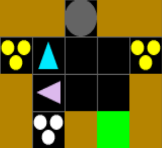

# Overcooked

Cooperative multi-agent cooking: pick up ingredients, cook soups, plate, and deliver for reward.

{ width="60%" }

**Objects**

| Char | Name |
|------|------|
| `O` | OnionStack |
| `T` | TomatoStack |
| `o` | Onion |
| `t` | Tomato |
| `U` | Pot |
| `=` | PlateStack |
| `P` | Plate |
| `S` | OnionSoup |
| `!` | TomatoSoup |
| `@` | DeliveryZone |
| `C` | Counter |

**Recipes**

Recipes are declared on the `Pot` class using `Container` and `Recipe` descriptors. The autowire system reads these and auto-generates all interaction branches, tick handlers, extra state, and static tables -- no manual wiring needed.

```python
from cogrid.core.containers import Container, Recipe
from cogrid.core.grid_object import register_object_type, GridObj

@register_object_type("pot", scope="overcooked")
class Pot(GridObj):
    container = Container(capacity=3, pickup_requires="plate")
    recipes = [
        Recipe(["onion", "onion", "onion"], result="onion_soup", cook_time=30, reward=1.0),
        Recipe(["tomato", "tomato", "tomato"], result="tomato_soup", cook_time=30, reward=1.0),
    ]
```

- **`Recipe.ingredients`** -- ingredient names that fill the pot (can be mixed, e.g. `["onion", "onion", "tomato"]`).
- **`Recipe.result`** -- output object type produced when cooking finishes.
- **`Recipe.cook_time`** -- steps the pot cooks once full (default 30).
- **`Recipe.reward`** -- delivery reward value for this recipe's output.
- **`Container.capacity`** -- max items the pot holds.
- **`Container.pickup_requires`** -- what the agent must hold to pick up from the pot (e.g. `"plate"`).

**Layouts**

| Environment ID | Layout |
|----------------|--------|
| `Overcooked-CrampedRoom-V0` | Cramped Room |
| `Overcooked-AsymmetricAdvantages-V0` | Asymmetric Advantages |
| `Overcooked-CoordinationRing-V0` | Coordination Ring |
| `Overcooked-ForcedCoordination-V0` | Forced Coordination |
| `Overcooked-CounterCircuit-V0` | Counter Circuit |
| `Overcooked-CrampedRoom-SingleAgent-V0` | Cramped Room (1 agent) |

```python
env = registry.make("Overcooked-CrampedRoom-V0")
```

**Layout config**

Each layout is a config dict passed to `CoGridEnv`. The Cramped Room config:

```python
from cogrid.envs.overcooked.rewards import DeliveryReward, OnionInPotReward, SoupInDishReward

cramped_room_config = {
    "name": "overcooked",                 # scope name for component registry
    "num_agents": 2,                      # cooperative two-player
    "action_set": "cardinal_actions",     # up/down/left/right + interact
    "features": [                         # observation vector components
        "agent_dir",                      # facing direction
        "overcooked_inventory",           # one-hot held item
        "next_to_counter",               # cardinal adjacency to counters
        "next_to_pot",                    # pot adjacency + status encoding
        "object_type_masks",             # binary spatial masks for 7 types
        "ordered_pot_features",          # per-pot contents/timer/distance
        "dist_to_other_players",         # delta to partner
        "agent_position",                # grid coordinates
        "can_move_direction",            # passable neighbor cells
    ],
    "rewards": [                          # reward functions composed each step
        DeliveryReward(coefficient=1.0, common_reward=True),
        OnionInPotReward(coefficient=0.1, common_reward=False),
        SoupInDishReward(coefficient=0.3, common_reward=False),
    ],
    "grid": {"layout": "overcooked_cramped_room_v0"},  # ASCII layout ID
    "max_steps": 1000,                    # episode length
    "scope": "overcooked",               # component registry scope
    "pickupable_types": ["onion", "onion_soup", "plate", "tomato", "tomato_soup"],
}
```

Different layouts swap `grid.layout`; different gameplay swaps `rewards` and `features`. The single-agent variant sets `num_agents: 1`.

**Rewards**

| Class | Coefficient | Description |
|-------|-------------|-------------|
| `DeliveryReward` | 1.0 | Multi-recipe delivery via IS_DELIVERABLE table (common) |
| `OrderDeliveryReward` | 1.0 | Delivery gated on active orders with optional tip bonus (common) |
| `OnionSoupDeliveryReward` | 1.0 | Simple onion-soup-only delivery (common) |
| `OnionInPotReward` | 0.1 | Place an onion into a pot with capacity (individual) |
| `SoupInDishReward` | 0.3 | Pick up finished soup from pot with a plate (individual) |
| `ExpiredOrderPenalty` | -5.0 | Penalty when an active order expires (common) |

**Order queue**

By default the order queue is disabled -- any valid delivery earns a reward. When enabled, orders spawn at intervals, count down, and expire with a penalty.

```python
order_config = {
    "max_active": 3,          # max concurrent orders
    "spawn_interval": 40,     # steps between spawns
    "time_limit": 200,        # steps before expiry
    "recipe_weights": [2.0, 1.0],  # relative spawn frequency per recipe
}
```

- **`max_active`** -- maximum simultaneous orders.
- **`spawn_interval`** -- steps between new order spawns.
- **`time_limit`** -- steps before an order expires.
- **`recipe_weights`** -- deterministic round-robin weights (e.g. `[2.0, 1.0]` spawns recipe 0 twice per recipe 1).

Enable by initializing order arrays with `build_order_extra_state` and composing `order_queue_tick` with the auto-generated container tick. Use `OrderDeliveryReward` and `ExpiredOrderPenalty` in the rewards list.

```python
from cogrid.envs.overcooked.config import build_order_extra_state, order_queue_tick

order_extra = build_order_extra_state(order_config)
# Merge into environment extra_state at reset time
```

**Custom ingredients**

New ingredient + stack pairs are registered at runtime with `make_ingredient_and_stack()`. Must be called before environment creation so interaction tables include the new types.

```python
from cogrid.envs.overcooked.overcooked_grid_objects import make_ingredient_and_stack
from cogrid.core import constants

Mushroom, MushroomStack = make_ingredient_and_stack(
    ingredient_name="mushroom",
    ingredient_char="m",
    ingredient_color=constants.Colors.Brown,
    stack_name="mushroom_stack",
    stack_char="M",
    scope="overcooked",
)
```

`OvercookedInventory` observations auto-adjust -- the feature dynamically discovers all pickupable types from the registry at compose time.

**Order observations**

The `OrderObservation` feature encodes active orders into the observation vector.

- **Dimension:** `max_active * (n_recipes + 1)` (default: 3 * 3 = 9).
- **Per order:** recipe one-hot (`n_recipes`) + normalized time remaining (0.0--1.0).
- **Global:** `per_agent = False` -- all agents see the same order state.
- **Backward compatible:** returns zeros when orders are not configured.

Add `"order_observation"` to the features list:

```python
config["features"].append("order_observation")
```
